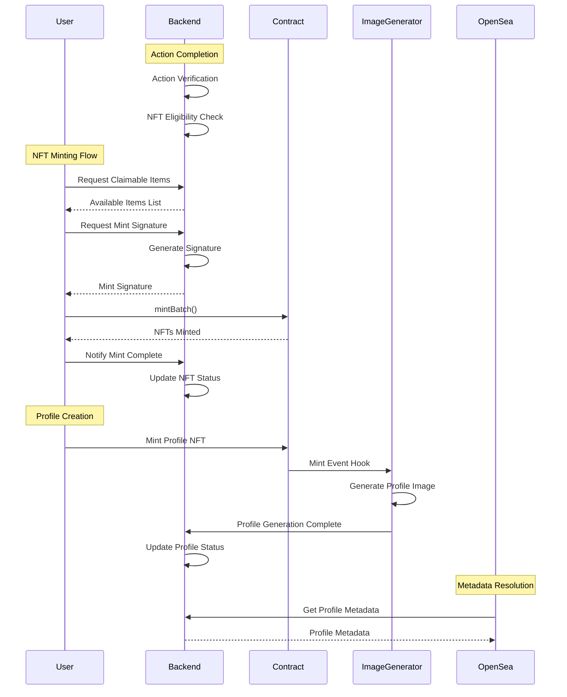

# Metis Profile NFT

Welcome to the Metis Profile NFT project! This project is designed to manage and interact with profile NFTs for the Toaster Finance platform on Metis Andromeda.

## Table of Contents

- [Metis Profile NFT](#metis-profile-nft)
  - [Table of Contents](#table-of-contents)
  - [Introduction](#introduction)
  - [System Architecture](#system-architecture)
  - [Features](#features)
  - [NFT Attributes](#nft-attributes)
  - [Item Details](#item-details)
  - [Installation](#installation)
  - [Test](#test)
  - [Deploy on local hardhat node](#deploy-on-local-hardhat-node)
  - [License](#license)

## Introduction

Toaster Items Contract is a collectible NFT system that allows users to create, manage, and customize their profile NFTs on the Toaster Finance platform. Each NFT represents a unique user profile that can be customized with various attributes based on their DeFi activities on Metis.

## System Architecture

The following diagram illustrates the interaction flow between different components of the system:



The system uses Alchemy Webhook for image generation, ensuring efficient and automated profile image creation upon minting.

## Features

- Create and mint unique profile NFTs
- Customize profile attributes based on DeFi activities
- Automated profile image generation
- On-chain verification of achievements

## NFT Attributes

The NFT system consists of 4 main attributes, and each profile NFT includes a randomly selected background to add uniqueness:

1. **Face (Deposit)**: Represents deposit activities

   - Includes variations like Droopy (Aave V3), Wide-Eyed (Artemis), etc.

2. **Gloves (Bridge)**: Represents bridge activities

   - Features Pink (Stargate V2), Yellow (Symbiosis)

3. **Shoes (Swap)**: Represents swap activities

   - Includes variations for different tokens (METIS, m.USDT, m.USDC, etc.)

4. **Special (Optional)**: Custom attributes

**Background**: Automatically and randomly selected from:

- Common backgrounds: Lavender, Mint, Pink, Beige, etc.
- Rare backgrounds (Chain specific): Spring, Twilight, Rainbow

Each item has a unique ID calculated by: `256 * itemId + attrId`

## Sample Profile NFT

Here's an example of a Profile NFT:


This profile represents a user who has:

- Used Artemis protocol for deposits (Wide-Eyed face, ID: 512)
- Performed cross-chain transactions via Symbiosis bridge (Yellow gloves, ID: 257)
- Traded METIS tokens (Sky shoes, ID: 2)
- Randomly received the Twilight background

The combination of these attributes tells the story of the user's DeFi activities on Metis network. Each attribute is earned through specific activities:

- **Face**: Earned by depositing in Artemis protocol
- **Gloves**: Earned by using Symbiosis bridge
- **Shoes**: Earned by trading METIS tokens
- **Background**: Randomly assigned during profile creation

For detailed item images and descriptions, see [Item Details](./Metis%20Profile%20NFT%20Description.md).

## Installation

To install and run the project locally, follow these steps:

1. Clone the repository:
   ```bash
   git clone https://github.com/your-username/metis-profile-nft.git
   ```
2. Navigate to the project directory:
   ```bash
   cd metis-profile-nft
   ```
3. Install dependencies:
   ```bash
   yarn install
   ```
4. Set up environment variables:
   ```bash
   cp .env.sample .env
   # Edit .env with your configuration
   ```


## Development

### Local Testing

```bash
yarn test
```

### Local Deployment

```bash
npx hardhat node
yarn deploy:local
```

### Mainnet Deployment

1. Configure your environment variables in `.env`
2. Deploy contracts:
   ```bash
   yarn deploy:metis
   ```
3. Setup attributes:
   ```bash
   yarn setup:metis
   ```
4. Set resolvers:
   ```bash
   yarn resolver:metis
   ```

> 🔒 **Security**: Make sure to use different private keys for different purposes (deployment, resolver, etc.) and keep them secure.

## License

This project is licensed under the MIT License. See the [LICENSE](LICENSE) file for more details.
